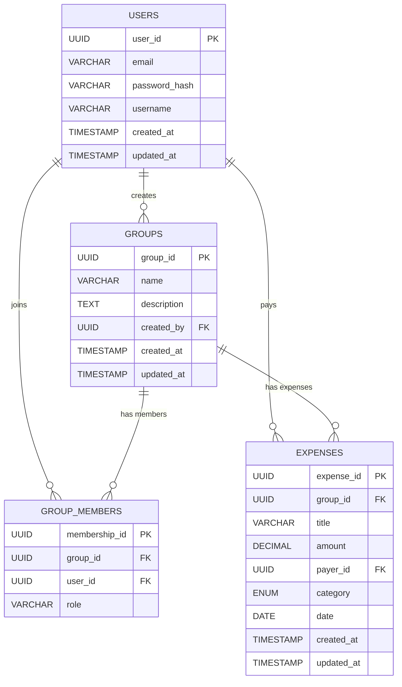

```mermaid
erDiagram

    USERS {
        UUID user_id PK
        VARCHAR email
        VARCHAR password_hash
        VARCHAR username
        TIMESTAMP created_at
        TIMESTAMP updated_at
    }

    GROUPS {
        UUID group_id PK
        VARCHAR name
        TEXT description
        UUID created_by FK
        TIMESTAMP created_at
        TIMESTAMP updated_at
    }

    GROUP_MEMBERS {
        UUID membership_id PK
        UUID group_id FK
        UUID user_id FK
        VARCHAR role
    }

    EXPENSES {
        UUID expense_id PK
        UUID group_id FK
        VARCHAR title
        DECIMAL amount
        UUID payer_id FK
        ENUM category
        DATE date
        TIMESTAMP created_at
        TIMESTAMP updated_at
    }

    %% Relationships
    USERS ||--o{ GROUPS : "creates"
    USERS ||--o{ GROUP_MEMBERS : "joins"    
    USERS ||--o{ EXPENSES : "pays"

    GROUPS ||--o{ GROUP_MEMBERS : "has members"
    GROUPS ||--o{ EXPENSES : "has expenses"
```